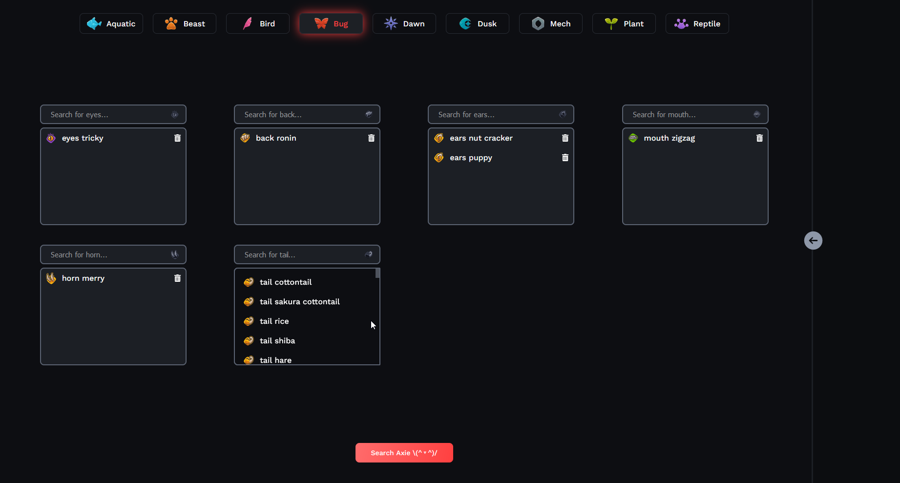
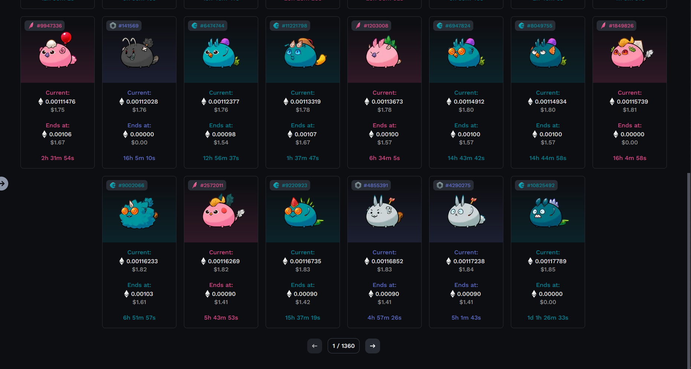
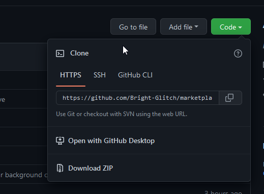

# Marketplace filter for auction Axies only
### Read the instructions to install
### Preview:

**1. Download the project. Click on `Code` then `Download ZIP`**

**2. Install Node.js on your computer**

[Official Node.js site:](https://nodejs.org/en/)

**3. Run your terminal, you can find it writing cmd on your PC search bar**

Now you'll need to direct your terminal to the project folder, you can use this comands:

Write 'ls' and press 'Enter'. It will show you the list of folders in the current path.

to go to a path write 'cd' and the folder you want to go to. for example: 'cd project-folder' and press 'Enter'

Once you're placed in the project directory in your terminal, run the following:

'npm install -g pnpm' and press 'enter'.

'pnpm install' and press 'enter'

Once the installation is finished run  'pnpm run dev' in your terminal and press 'enter'

Leave the terminal running in the background, you'll be able to access the Marketplace filter site on this URL: [http://localhost:3000/](http://localhost:3000/)

to stop the site running go to you terminal and press 'ctl + C' and close it

### If you already followed this steps, next time you will only need to go to the path of the project in your terminal and run 'pnpm run dev' and press enter

If you encounter any issue or error you can reach me out on discord.
